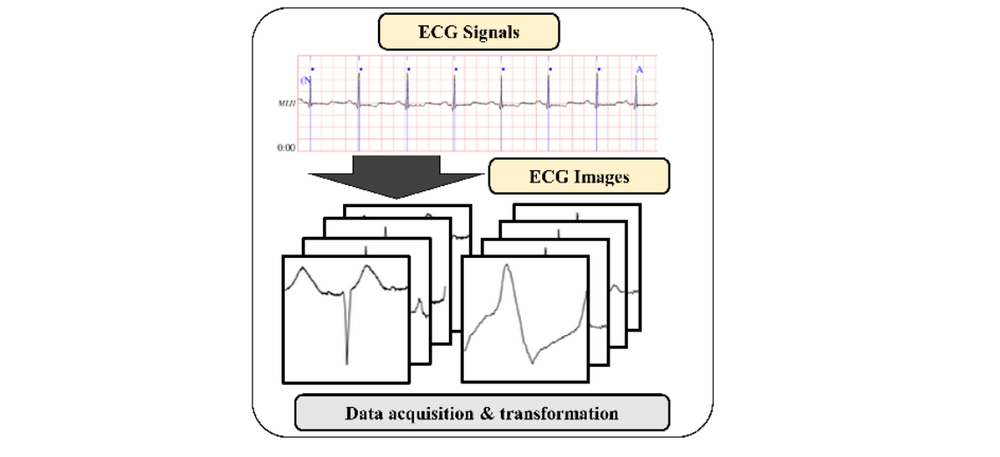
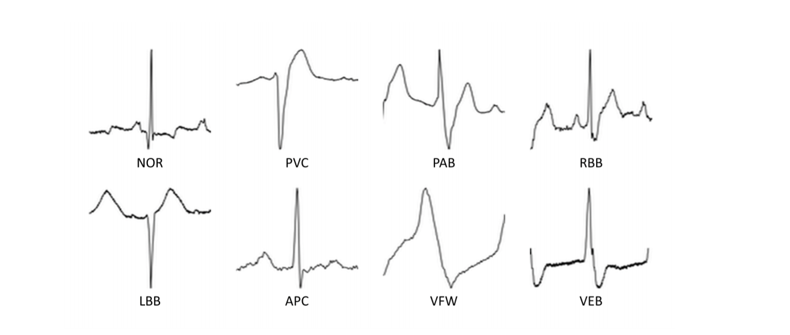
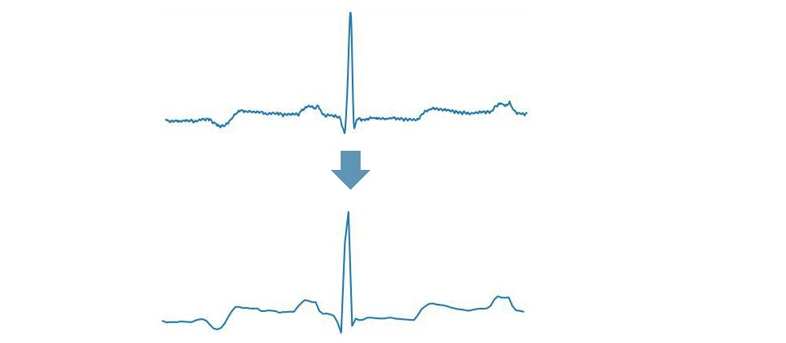
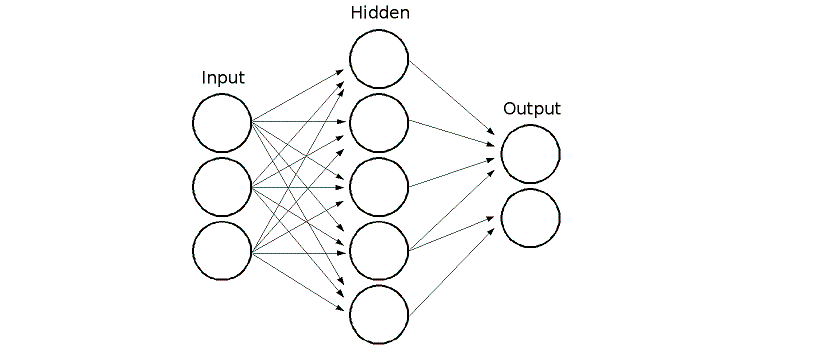

## ECG-Arrhythmia-classification
During this work I was inspired from this paper https://arxiv.org/pdf/1804.06812.pdf in which they classify ECG into seven categories, one being normal and the other six being different types of arrhythmia using convolutional neural network.
Using a **Ensemble learnig**  techinque, which combines the result of several classifiers to get one only.

in this case two classifiers were used:

- Convolutional neural networks with 11 hidden layers and an accuracy equal to 95.93%
- Artificial neural networks with just 1 hidden layers and an accuracy equal to 96.89%

The final result, obtained applied the weighted average, using f-measure, between the two results, is an accuracy equal to 97.86%


## Convolutional Neural Network

### Convert Signal to Image

Convolutional neural networks required images as input, therefore, I transformed signals into ECG images by plotting each ECG beat as an individual 128 x 128 grayscale image.

MIT-BIH provides an additional file containing information about Q-wave peak.

Thus we create image for each Q-wave using thi formula:


<div style="text-align:center">
    
</div>


<div style="text-align:center">
    
</div>


### Classes labels

As a result, we obtained 100,000 images from the MIT-BIH arrhythmia
database where each image is one of eight ECG beat types.

<div style="text-align:center">
    
</div>


### Data Augmentation

Data augmentation is one of the key benefits of using images as input data.
The majority of previous ECG arrhythmia works could not manually add an data into training set since the distortion of single ECG signal may downgrade the performance in the test set.

Transformation:

- Rotation (-30°, +30°)
- Flip (Horizontal, Vertical, Horizontal-Vertical)
- Cropping


<div style="text-align:center">
    
</div>


### Remove Noise

In orderd to remove noise from each imges it used **Piecewise Aggregate Approximation** algorithm, which simply means that in order to reduce the dimensionality from *n* to *M*, we first divide the original time-series into *M* equally sized frames and secondly compute the mean values for each frame. The sequence assembled from the mean values is the PAA approximation (i.e., transform) of the original time-series.


<div style="text-align:center">
    
</div>


### Convolutional Neural Networks Struction

<div style="text-align:center">
    
</div>


## Artificial Neural Network


<div style="text-align:center">
    
</div>
Artificial neural network proposed is formed just by an hidden layer with one hundred  neurons.


## Models

Here is the link to the models: https://drive.google.com/open?id=1NOO7zrl6BClrGPxItWrbPI8HK1Xza6zb


## Result

The ECG arrhythmia recordings used in this paper are obtained from the MITBIH database. 

The database contains 48 half-hour ECG recordings collected from 47 patients between 1975 and 1979. 

The ECG recording is sampled at 360 samples per second. There are approximately 110,000 ECG beats in MIT-BIH database with 15 different types of arrhythmia including normal.

Dataset has been divided i three parts:

- Training set (70%)
- Validation set (15%)
-  Test set (15%)

The network has been traindend for 100 epochs for 10 hours.


### Confusion matrix (Test set)

|         | VEB        | PAB          | RBB           | PVC          | NOR        | LBB          | APC       | VFW       |
| ------- | ---------- | ------------ | ------------- | ------------ | ---------- | ------------ | --------- | --------- |
| **VEB** | **302,00** | 1,00         | 12,00         | 0,00         | 5,00       | 2,00         | 0,00      | 1,00      |
| **PAB** | 0,00       | **1.151,00** | 1,00          | 0,00         | 5,00       | 0,00         | 0,00      | 1,00      |
| **RBB** | 77,00      | 56,00        | **11.188,00** | 7,00         | 62,00      | 38,00        | 3,00      | 7,00      |
| **PVC** | 0,00       | 0,00         | 3,00          | **1.040,00** | 3,00       | 0,00         | 1,00      | 0,00      |
| **NOR** | 1,00       | 3,00         | 44,00         | 6,00         | **990,00** | 0,00         | 0,00      | 5,00      |
| **LBB** | 1,00       | 0,00         | 4,00          | 0,00         | 1,00       | **1.049,00** | 0,00      | 0,00      |
| **APC** | 0,00       | 0,00         | 0,00          | 0,00         | 0,00       | 0,00         | **12,00** | 0,00      |
| **VFW** | 1,00       | 0,00         | 1,00          | 1,00         | 4,00       | 0,00         | 0,00      | **57,00** |

​     

### Conclusion 

So far the best result achieved is **acc: 97.86%**


## Local Installation

### Clone the repo
```shell
$ git clone https://github.com/lorenzobrusco/ECGNeuralNetwork.git
```


### Download dataset

```shell
wget --mirror --no-parent https://www.physionet.org/physiobank/database/mitdb/
```


### Install requirements

```shell
$ pip install -r requirements.txt
```

Make sure you have the following installed:
- Werkzeug
- Flask
- numpy
- Keras
- gevent
- pillow
- h5py
- tensorflow
- opencv-python
- biosppy
- wfdb
- tqdm


### Run with Python

Python 2.7 or 3.5+ are supported and tested.

```shell
$ python ecgnn.py
```


### Create Images

Run this script to create the dataset
```shell
$ python convert_signal_img.py
```
