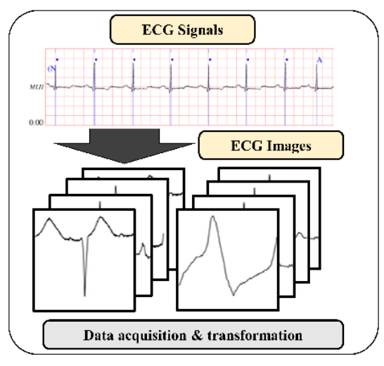
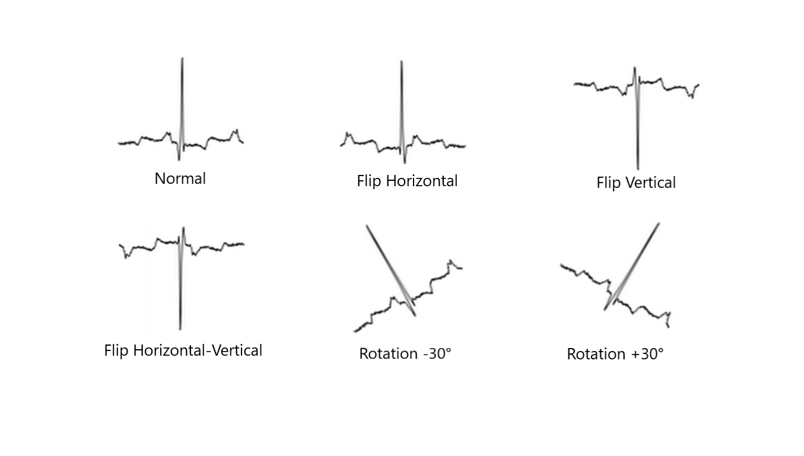

## ECG-Arrhythmia-classification
During this work I was inspired from this paper "" in which they classify ECG into seven categories, one being normal and the other six being different types of arrhythmia using convolutional neural network.
Using a convolutional neural networks with 11 layers I've reached an accuracy equal to 94.01%, this result has been achieved adding some data augmentation.

### Convert Signal to Image

Convolutional neural networks required images as input, therefore, I transformed signals into ECG images by plotting each ECG beat as an individual 128 x 128 grayscale image.

MIT-BIH provides an additional file containing information about Q-wave peak.

Thus we create image for each Q-wave using thi formula:
$$
T(Qpeak(n - 1) + 20) \leq T(n) \leq T(Qpeak(n + 1) - 20)
$$

<div style="text-align:center">
    
</div>


### Classes labels

As a result, we obtained 100,000 images from the MIT-BIH arrhythmia
database where each image is one of eight ECG beat types.

<div style="text-align:center">
    
</div>


### Data Augmentation

Data augmentation is one of the key benefits of using images as input data.
The majority of previous ECG arrhythmia works could not manually add an data into training set since the distortion of single ECG signal may downgrade the performance in the test set.

Transformation:

- Rotation (-30°, +30°)
- Flip (Horizontal, Vertical, Horizontal-Vertical)
- Cropping


<div style="text-align:center">
    
</div>


### Convolutional Neural Networks Struction

<div style="text-align:center">
    
</div>


## Model

Here is the link to the model: https://drive.google.com/open?id=12Hk4F6VDEeCahq7IMeS8j2Sbhf1Hsq9k


## Local Installation

### Clone the repo
```shell
$ git clone https://github.com/lorenzobrusco/ECGNeuralNetwork.git
```


### Download dataset

```shell
wget --mirror --no-parent https://www.physionet.org/physiobank/database/mitdb/
```

### Install requirements

```shell
$ pip install -r requirements.txt
```

Make sure you have the following installed:
- Werkzeug
- Flask
- numpy
- Keras
- gevent
- pillow
- h5py
- tensorflow
- opencv-python
- biosppy
- wfdb
- tqdm


### Run with Python

Python 2.7 or 3.5+ are supported and tested.

```shell
$ python ecgnn.py
```


### Create Images

Run this script to create the dataset
```shell
$ python convert_signal_img.py
```
